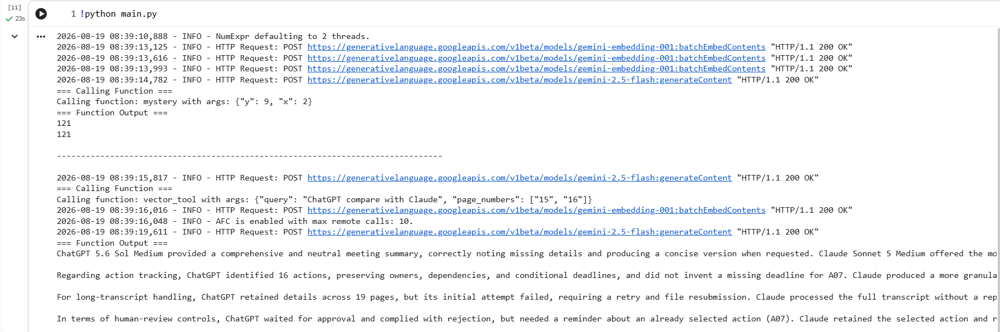

# Tool Calling Agent

An LLM agent that decides which functions ("tools") to call based on the question, then calls them directly with generated arguments — including a metadata-filtered vector search tool.

## How it works

- Two simple math functions (`add`, `mystery`) are wrapped as `FunctionTool`s to demonstrate basic function calling.
- The source PDF is loaded, split into chunks, and indexed with a `VectorStoreIndex`.
- A `vector_query` function is also wrapped as a tool. It accepts a `page_numbers` argument — if the question mentions specific pages, the LLM fills this in automatically, and the tool filters the vector search by `page_label` metadata. Leave it blank and it searches the whole document instead.
- A `summary_tool` is included alongside it, using `tree_summarize` for whole-document questions.
- `llm.predict_and_call([tools], "question")` is what ties it together: given a question and a list of available tools, the LLM decides which tool(s) to call and what arguments to call them with, then returns the result.

## Files

| File | Purpose |
|---|---|
| `helper.py` | Loads your Gemini API key from `.env` |
| `utils.py` | Defines the tools: `add`, `mystery`, `vector_query` (with page filtering), and `summary_tool` |
| `main.py` | Runs three example queries — a math tool call, a page-filtered vector search, and a full-document summary |
| `requirements.txt` | Python dependencies |

## Setup

1. **Install dependencies:**
   ```bash
   pip install -r requirements.txt
   ```

2. **Create a `.env` file** in this folder with your Gemini API key:
   ```
   GOOGLE_API_KEY=your_actual_key_here
   ```
   Get a free key from [Google AI Studio](https://aistudio.google.com/apikey).

3. **Add a PDF.** Place any PDF in this folder and update the filename in `main.py` (`build_tools("your-file.pdf")`) to match. Update the example questions in `main.py` to match your document's actual content.

4. **Run it:**
   ```bash
   python main.py
   ```

> **Note:** if you have a very new/unreleased Python version installed locally, some of these packages may not install cleanly in an editor like VS Code. If you hit install errors, it's easier to just run this in [Google Colab](https://colab.research.google.com/) instead, which uses a stable, well-supported Python version.

## Example output

Running `main.py` prints, with `verbose=True`, which tool the LLM chose for each question and the arguments it generated (e.g. `page_numbers=["15", "16"]`), followed by the response.


